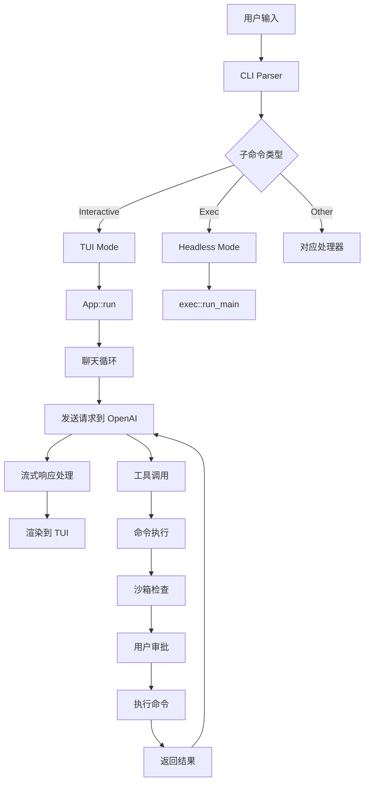
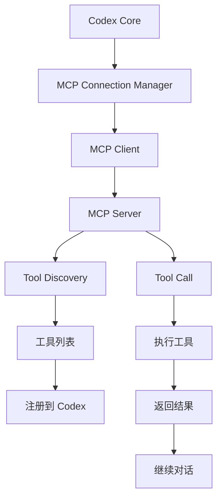
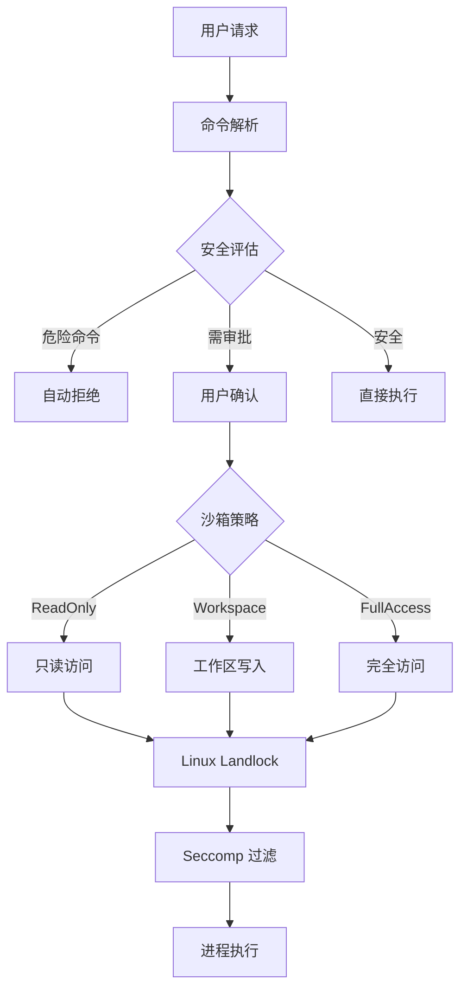
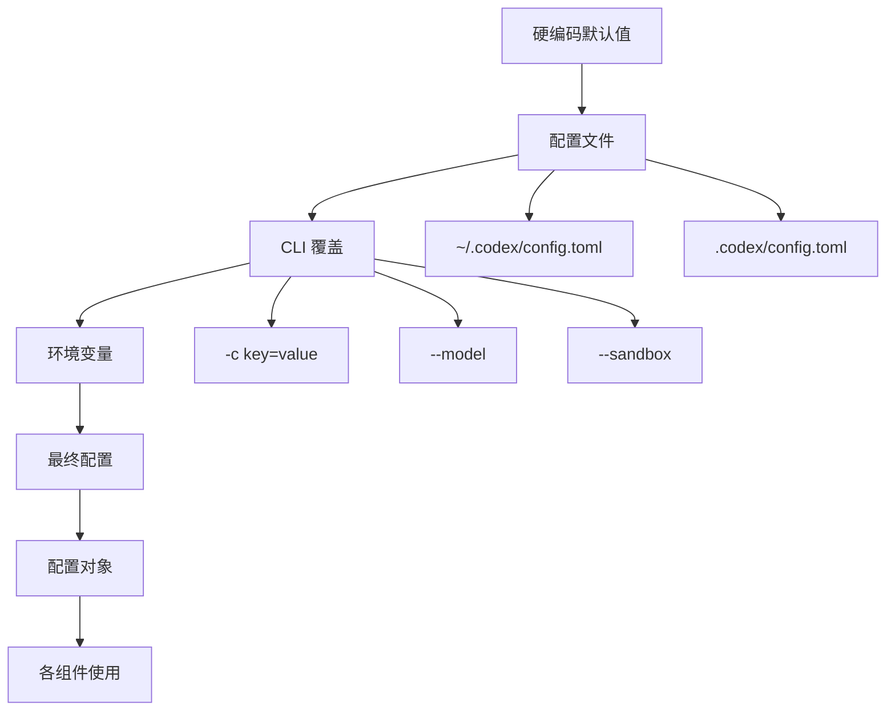
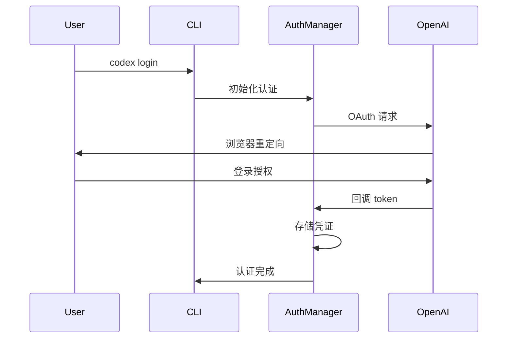
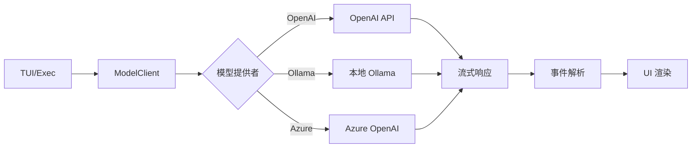
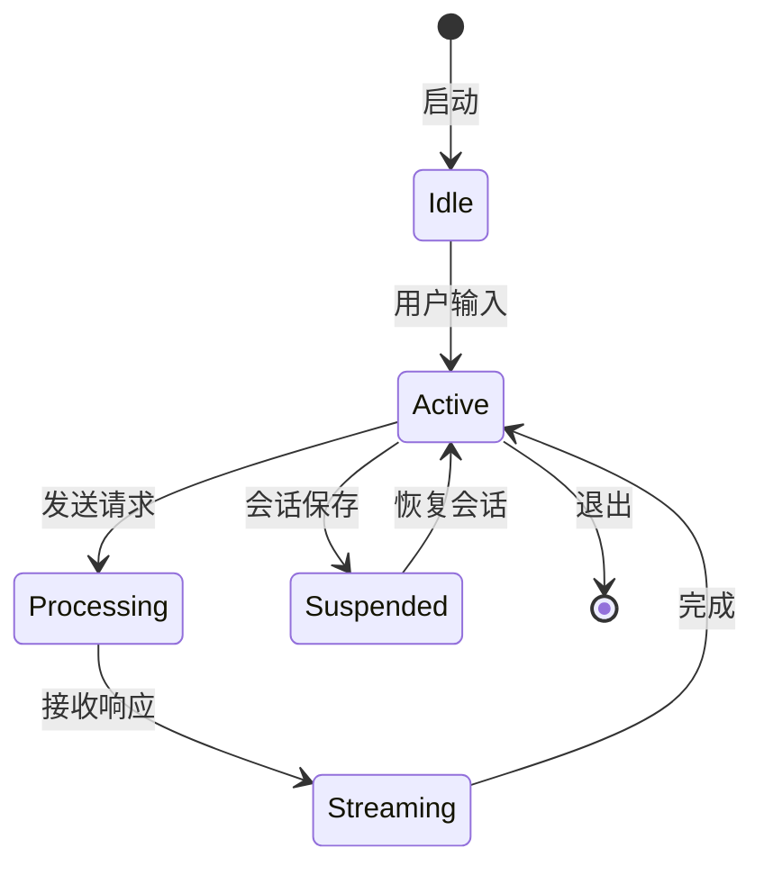
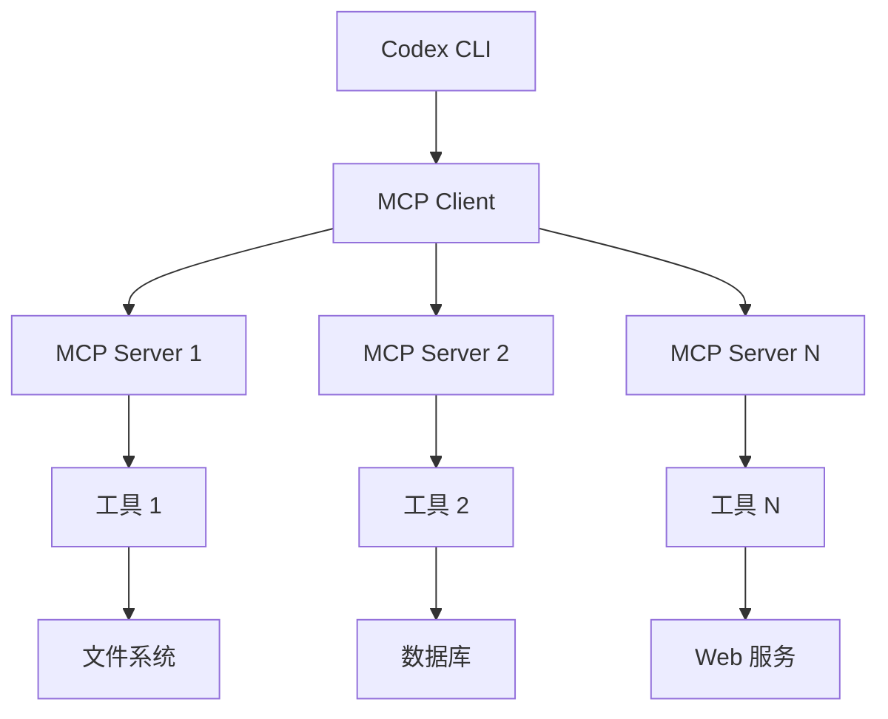

# Codex CLI 架构分析文档

## 概述

Codex CLI 是 OpenAI 开发的命令行编码助手，提供本地运行的 AI 编程助手功能。项目采用 Rust 作为主要实现语言，提供高性能、零依赖的二进制分发。

## 项目结构

```
codex/
├── codex-cli/          # 遗留的 TypeScript 实现（已废弃）
├── codex-rs/           # Rust 实现（当前主要维护版本）
├── sdk/                # TypeScript SDK
├── shell-tool-mcp/     # MCP 服务器实现
└── docs/               # 文档
```

## 核心架构

### 1. 模块组织架构

Codex CLI 采用 Cargo Workspace 架构，包含 46 个 crates，主要分为以下几个层次：

#### 1.1 应用层（CLI Interface）
- **cli/**: 多工具 CLI 入口，提供子命令路由
- **tui/**: 基于 Ratatui 的全屏终端用户界面
- **exec/**: 非交互式 headless CLI，用于自动化场景

#### 1.2 业务逻辑层（Core Business Logic）
- **core/**: 核心业务逻辑库，包含 Codex 主要功能
- **common/**: 共享类型和配置定义
- **protocol/**: 通信协议定义

#### 1.3 服务层（Services）
- **backend-client/**: OpenAI API 客户端
- **login/**: 认证和登录管理
- **mcp-server/**: MCP 服务器实现
- **mcp-types/**: MCP 类型定义

#### 1.4 执行层（Execution）
- **execpolicy/**: 命令执行策略管理
- **linux-sandbox/**: Linux Landlock + seccomp 沙箱
- **apply-patch/**: 补丁应用工具
- **file-search/**: 文件搜索功能

#### 1.5 工具层（Utilities）
- **utils/*** 多个实用工具 crate
- **ansi-escape/**: ANSI 转义序列处理
- **async-utils/**: 异步工具

### 2. 核心模块详解

#### 2.1 codex-core (121KB)

核心业务逻辑模块，包含主要功能：

**主要组件：**
```
codex-core/src/
├── codex.rs              # 主 Codex 会话管理（121KB）
├── auth.rs               # 认证管理（40KB）
├── config/               # 配置管理
├── client.rs             # API 客户端
├── exec.rs               # 命令执行
├── mcp_connection_manager.rs  # MCP 连接管理（39KB）
├── git_info.rs           # Git 集成
├── parse_command.rs      # 命令解析（57KB）
└── tools/                # 工具集合
```

**核心功能：**
- CodexConversation: 管理对话会话
- ConversationManager: 会话生命周期管理
- MCP 连接管理和工具调用
- 命令执行和安全策略
- Git 集成和差异追踪

#### 2.2 codex-cli (主入口)

多工具 CLI，支持子命令路由：

```rust
enum Subcommand {
    Exec,           // 非交互式执行
    Login,          // 认证管理
    Logout,         // 退出登录
    Mcp,            // MCP 管理
    McpServer,      // 运行 MCP 服务器
    AppServer,      // 应用服务器
    Completion,     // Shell 补全
    Sandbox,        // 沙箱测试
    Apply,          // 应用补丁
    Resume,         // 恢复会话
    Cloud,          // 云任务
    ...
}
```

#### 2.3 codex-tui (终端界面)

基于 Ratatui 的全屏终端 UI，包含：

```
tui/src/
├── app.rs              # 主应用逻辑
├── chatwidget.rs       # 聊天组件
├── exec_command.rs     # 命令执行单元
├── markdown_render.rs  # Markdown 渲染
├── session_log.rs      # 会话日志
└── onboarding/         # 新手引导
```

**UI 特性：**
- 实时流式响应
- 语法高亮的代码块
- 交互式命令审批
- 会话历史管理
- 文件差异显示

### 3. 数据流架构

#### 3.1 请求处理流程



#### 3.2 MCP 集成架构



### 4. 安全架构

#### 4.1 分层安全模型



#### 4.2 沙箱实现

**Linux (Landlock + Seccomp):**
```rust
codex-linux-sandbox/
├── src/landlock.rs      # Landlock LSM 集成
├── src/linux_run_main.rs
└── src/main.rs
```

**macOS (Seatbelt):**
```rust
codex-core/src/seatbelt.rs
├── seatbelt_base_policy.sbpl
└── seatbelt_network_policy.sbpl
```

**Windows (受限令牌):**
```rust
codex-windows-sandbox/
└── src/  # Windows 受限令牌实现
```

### 5. 配置系统

#### 5.1 配置层次



#### 5.2 配置结构

```toml
# ~/.codex/config.toml
model = "gpt-4.1"
approval_policy = "suggest"
sandbox_mode = "read-only"

[features]
web_search_request = true
unified_exec = false

[mcp_servers]
python = { command = "uvx", args = ["mcp-server-python"] }
```

### 6. 认证架构

#### 6.1 认证流程



#### 6.2 支持的认证方式

- **ChatGPT OAuth**: 主要认证方式，支持 Plus/Pro/Team/Edu/Enterprise
- **API Key**: 备用认证方式（需要特殊配置）
- **Device Code**: 无浏览器环境的认证

### 7. 模型集成架构

#### 7.1 多模型支持

```rust
pub enum ModelProvider {
    OpenAI,      // OpenAI API
    Ollama,      // 本地 Ollama
    LMStudio,    // LM Studio
    Azure,       // Azure OpenAI
    ...
}
```

#### 7.2 请求处理



### 8. 会话管理

#### 8.1 会话存储

```
~/.codex/
├── sessions/
│   ├── active/          # 活跃会话
│   │   └── {uuid}/
│   │       ├── head.json      # 会话元数据
│   │       ├── turns/*.json   # 对话轮次
│   │       └── artifacts/     # 生成的文件
│   └── archived/        # 归档会话
├── config.toml          # 用户配置
└── auth.json           # 认证信息
```

#### 8.2 会话生命周期



### 9. 性能优化

#### 9.1 异步架构

- **Tokio Runtime**: 全异步 I/O 处理
- **流式处理**: 实时响应流式传输
- **连接池**: HTTP 连接复用
- **缓存**: 响应和工具结果缓存

#### 9.2 资源管理

```rust
// Token 使用追踪
pub struct TokenUsage {
    pub total_tokens: u32,
    pub input_tokens: u32,
    pub output_tokens: u32,
    pub reasoning_tokens: Option<u32>,
}

// 响应截断
pub fn truncate_messages(
    messages: &[Message],
    max_tokens: usize,
) -> Vec<Message>;
```

### 10. 测试架构

#### 10.1 测试分层

```
codex-rs/
├── unit_tests/         # 单元测试
├── integration_tests/  # 集成测试
└── e2e_tests/         # 端到端测试
```

#### 10.2 测试工具

- **Insta**: 快照测试（UI 输出验证）
- **WireMock**: API 模拟
- **Test Support Crates**: 测试辅助工具

### 11. 部署和分发

#### 11.1 构建系统

```bash
# 多平台构建
cargo build --release --target x86_64-unknown-linux-musl
cargo build --release --target aarch64-apple-darwin
cargo build --release --target x86_64-pc-windows-gnu

# 二进制大小优化
strip symbols
lto = "fat"
codegen-units = 1
```

#### 11.2 分发渠道

- **NPM**: `@openai/codex`
- **Homebrew**: `brew install --cask codex`
- **GitHub Releases**: 平台特定二进制
- **Docker**: 容器化部署

### 12. 扩展性设计

#### 12.1 MCP 生态集成



#### 12.2 插件系统

- **配置驱动**: 通过配置文件添加 MCP 服务器
- **动态加载**: 运行时工具发现
- **安全隔离**: 每个 MCP 服务器独立沙箱

### 13. 监控和可观测性

#### 13.1 遥测集成

- **OpenTelemetry**: 分布式追踪
- **Tracing**: 结构化日志
- **Metrics**: Prometheus 指标

#### 13.2 调试支持

```bash
# 详细日志
RUST_LOG=codex_core=debug,codex_tui=debug codex

# 会话日志
~/.codex/logs/codex-tui.log

# 性能分析
cargo flamegraph --bin codex
```

### 14. 代码质量保障

#### 14.1 静态分析

```bash
# Clippy 严格 lint
needless_borrow = "deny"
redundant_clone = "deny"
print_stdout = "deny"

# 格式化
rustfmt.toml 配置

# 安全检查
cargo audit
cargo shear
```

#### 14.2 测试覆盖率

- **单元测试**: 每个模块独立测试
- **集成测试**: API 和工具集成
- **UI 测试**: TUI 组件快照测试

### 15. 关键技术决策

#### 15.1 Rust vs TypeScript

**选择 Rust 的原因：**
- 性能：零成本抽象，编译时优化
- 安全：内存安全，并发安全
- 分发：单二进制，无需运行时
- 系统集成：直接调用系统 API

#### 15.2 异步架构

**Tokio 选择：**
- 生态成熟，社区活跃
- 高性能异步运行时
- 丰富的异步工具生态
- 与 Hyper/Reqwest 无缝集成

#### 15.3 沙箱策略

**多平台支持：**
- Linux: Landlock + seccomp
- macOS: Seatbelt (sandbox-exec)
- Windows: 受限令牌

### 16. 架构优势

1. **模块化**: 清晰的 crate 边界
2. **可测试**: 分层设计便于测试
3. **可扩展**: MCP 支持第三方集成
4. **安全**: 多层次沙箱保护
5. **性能**: 异步处理和优化
6. **用户体验**: 实时流式响应

### 17. 未来扩展方向

1. **IDE 集成**: 增强编辑器插件
2. **团队协作**: 共享会话和工作区
3. **智能缓存**: 上下文感知缓存
4. **自定义工具**: 更丰富的工具生态
5. **性能分析**: 内置性能分析工具
6. **多语言支持**: 国际化和本地化

## 总结

Codex CLI 采用现代化的 Rust 架构，通过模块化设计、强大的安全沙箱和丰富的 MCP 生态系统，提供了一个高性能、安全可靠的 AI 编程助手。其分层架构既保证了代码的可维护性，又为未来的功能扩展留下了充足的空间。
